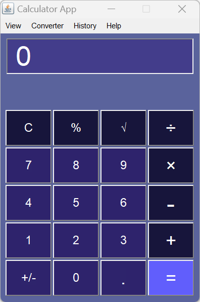

## Java AWT Calculator

This Simple Calculator application was built by using Java's Abstract Window Toolkit (AWT). This application will utilize various GUI components (Frames, Panel, Layout, Buttons, Text Field, and Menus) provided by AWT to create an interactive and user-friendly interface. The Calculator will be capable of performing basic arithmetic operations such as addition, subtraction, multiplication, and division. Additionally, percentage, square, square Root and backspace operations were added to this Calculator.

The Calculator application will implement event handling to respond to user actions. As an event handler this application uses ActionListener & Action Performed.

* ActionListener: To listen for and respond to button clicks.
* Action Performed: To define the actions to be taken when specific buttons are pressed.

## What's Changed
* java project by @cusaldmsr in https://github.com/cusaldmsr/AWTCalculator/pull/1
* Test branch awt by @cusaldmsr in https://github.com/cusaldmsr/AWTCalculator/pull/2
* update by @cusaldmsr in https://github.com/cusaldmsr/AWTCalculator/pull/3
* Merge pull request #3 from cusaldmsr/master by @cusaldmsr in https://github.com/cusaldmsr/AWTCalculator/pull/4

## New Contributors
* @cusaldmsr made their first contribution in https://github.com/cusaldmsr/AWTCalculator/pull/1

**Full Changelog**: https://github.com/cusaldmsr/AWTCalculator/commits/v1.0.0

## Preview

* Light Theam Preview

    

* Dark Theam Preview

    

