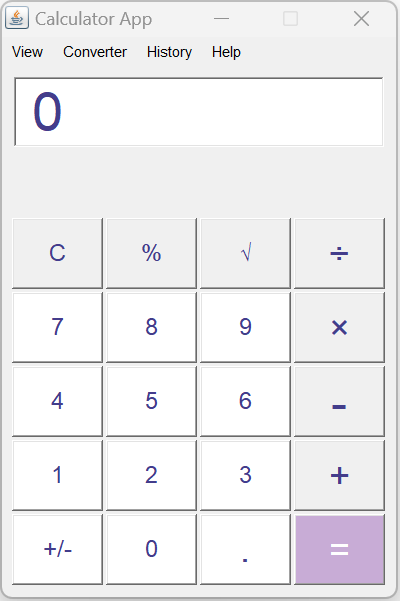
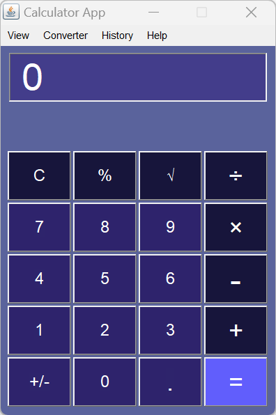

<h1 align="center">Java AWT Calculator</h1>

<p align="center">
    
    
    
    
    
</p>

<p align="center">
    <b>AWTCalculator</b> is a simple yet powerful calculator application built using Java's Abstract Window Toolkit (AWT). It provides a user-friendly graphical interface for performing basic and advanced arithmetic operations. The application demonstrates the use of various AWT GUI components and event handling mechanisms in Java.
</p>

---

## Features

- **Basic Arithmetic:** Addition, subtraction, multiplication, division
- **Advanced Operations:** Percentage, square root, negative mark
- **Clear Function:** Reset all input and output fields
- **Decimal Support:** Input and calculation with floating-point numbers
- **Theme Switching:** Light and Dark mode for better user experience
- **Responsive UI:** Layout adapts to different screen sizes
- **Keyboard & Mouse Support:** All operations accessible via mouse clicks

## Technologies Used

- **Java AWT:** For GUI components (Frame, Panel, Button, TextField, MenuBar, etc.)
- **Event Handling:** Uses `ActionListener` and `WindowAdapter` for user interaction
- **Singleton Pattern:** Ensures a single instance of the calculator logic
- **Custom Styling:** Colors, fonts, and layout for modern look

## Screenshots

### Light Theme
<div align="center">
    
</div>

### Dark Theme
<div align="center">
    
</div>

## How to Run

1. **Clone the repository:**
    ```sh
    git clone https://github.com/cusaldmsr/AWTCalculator.git
    cd AWTCalculator
    ```

2. **Build the project:**
    - Using NetBeans/IDE: Open the project and click "Build".
    - Using Ant (from terminal):
      ```sh
      ant jar
      ```

3. **Run the application:**
    - From IDE: Click "Run".
    - From terminal:
      ```sh
      java -jar dist/AWTCalculator.jar
      ```

## Usage

- Click the number buttons to enter values.
- Use arithmetic operator buttons (`+`, `-`, `×`, `÷`) for calculations.
- Press `=` to get the result.
- Use `C` to clear the current input.
- Use `√` for square root, `%` for percentage, and `+/-` to toggle negative values.
- Switch between Light and Dark mode from the "View" menu.

## Code Structure

- [`src/gui/Calculator.java`](src/gui/Calculator.java): Main application logic and GUI
- [`src/gui/cal`](src/gui/Calculator.java): Singleton class handling calculator operations
- [`Resources/`](Resources): Images for UI previews and contributors

## Event Handling

- **ActionListener:** Handles button clicks and menu selections
- **WindowAdapter:** Handles window closing event

## Contribution

Contributions are welcome! Please follow these steps:

1. Fork the repository
2. Create your feature branch (`git checkout -b feature/AmazingFeature`)
3. Commit your changes (`git commit -m 'Add some AmazingFeature'`)
4. Push to the branch (`git push origin feature/AmazingFeature`)
5. Open a Pull Request

## Security Policy

See [SECURITY.md](SECURITY.md) for supported versions and vulnerability reporting.

## License

This project is licensed under the MIT License.

## Contributors

<!-- readme: contributors -start -->
<table>
<tr>
    <td align="center">
        <a href="https://github.com/cusaldmsr" text-decoration="none">
            
            <br />
            <sub><b>Cusaldmsr</b></sub>
        </a>
    </td>
    <td align="center">
        <a href="https://github.com/cusaldmzr">
            
            <br />
            <sub><b>Cusaldmzr</b></sub>
        </a>
    </td>
</tr>
</table>
<!-- readme: contributors -end -->

---

**Full Changelog:** https://github.com/cusaldmsr/AWTCalculator/commits/v1.0.0

## Contact
For any questions or issues, please open an issue on GitHub or contact the contributors directly.